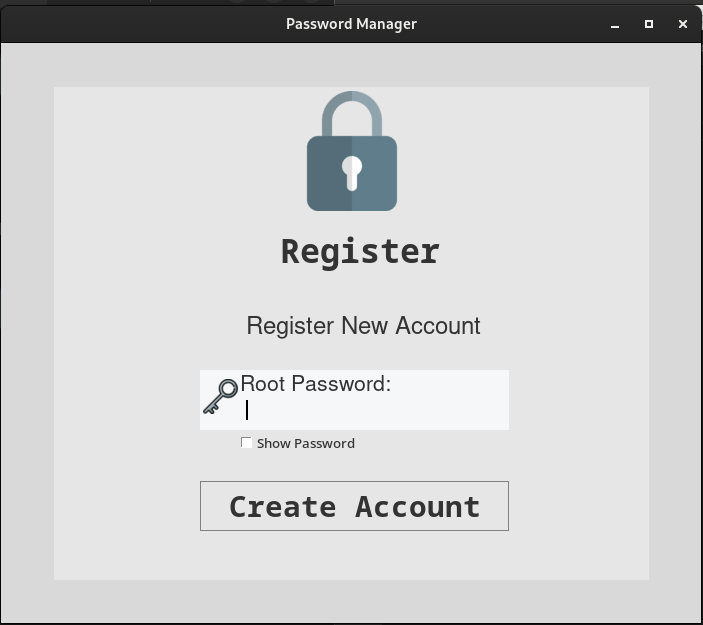
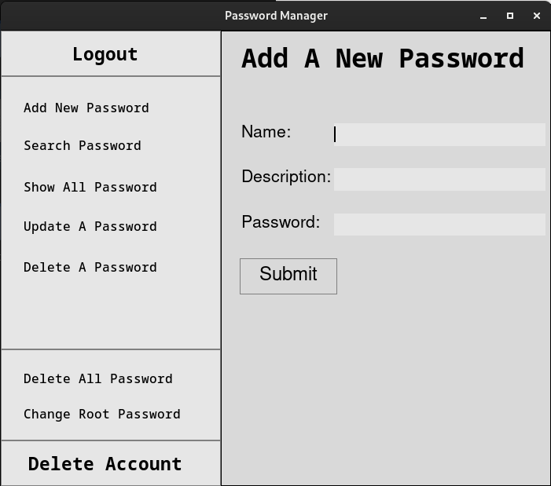

# PASSMAN

This program is a Desktop Application that safely stores your passwords and login details in a secure and organised manner.



### About

A password manager application. Made with python tkinter, It stores sensitive and important information safely and securely withough the worry of any infromation breach. All details are encrypted before being stored in a SQLite database.


### Features

It has a variety of functions, some which include:

- Updating Existing passwords
- Deleting irrelivant information
- Deleting the account if need be


## Getting Started

### Installation

1. Check if python is installed on your system using

   ```bash
   python -V
   ```

   if it's not installed, download it from [here](https://python.org/downloads/).
   It is advicable to get python 3.10 or later.
2. Clone the repository using:

   ```bash
   git clone https://github.com/Ecode2/passman.git
   ```
3. Navigate into the project directory with:

   ```bash
   cd passman
   ```
4. Install application requirements using

   ```bash
   pip install -r requirements.txt
   ```

## Using The App

Run the application with:

```bash
python passman.py
```

and that's all the application will start running

## Contributing

Contributions are welcome! If you want to contribute to this project, please follow these steps:

1. Fork the repository.
2. Create a new branch: `git checkout -b feature/new-feature`
3. Make your changes and commit them: `git commit -m 'Added a new feature'`
4. Push to the branch: `git push origin feature/new-feature`
5. Submit a pull request.
